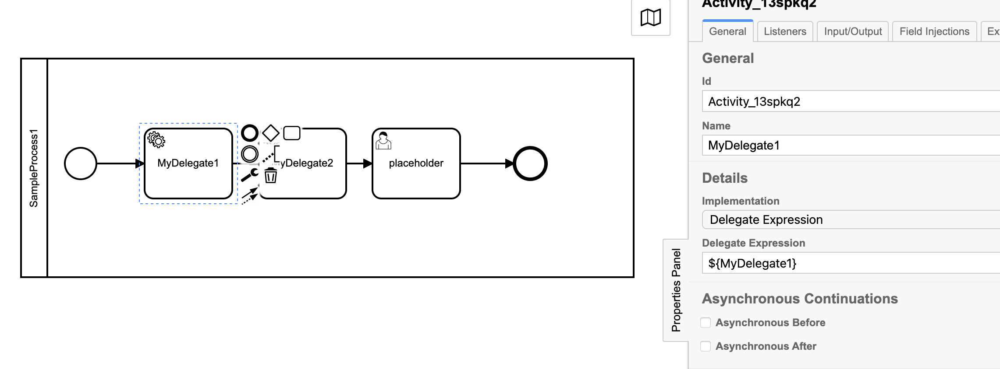
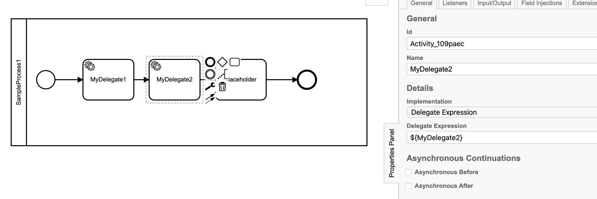
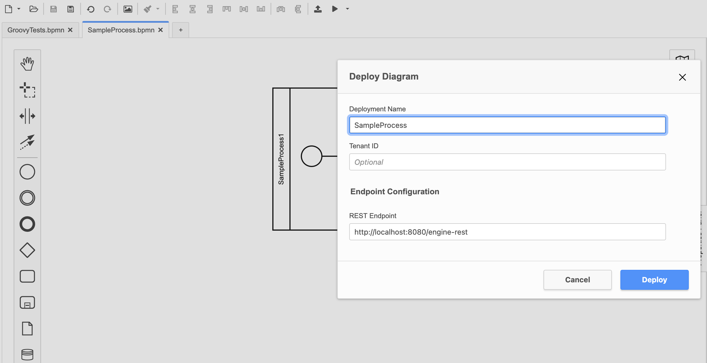
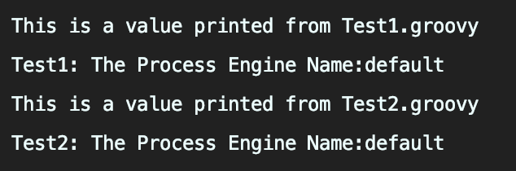

# Camunda Scripting Delegates Process Engine Plugin

Use scripting languages to build Camunda Delegates that can be updated during runtime executions.

[Camunda Forum Discussion](https://forum.camunda.org/t/scripting-based-delegates-with-springboot-camunda-run-and-source-code-bean-runtime-refresh/26386)

This means you can modify delegates after your BPMN has been deployed!

Supports Groovy scripting to build springboot beans / Java Delegates



That delegate is based on a groovy file, supports runtime refreshes of the delegate bean, supports debug/breakpoints, dependency injection (autowiring), etc.

All the great features you want without any of the hassle of "Compile, Test, Fix, Compile" dev loops :rocket:


# How do I use it?

1. You can deploy the jar into your SpringBoot application or,
1. Add the configuration into a **Camunda-Run** deployment


## Camunda-Run Distro Usage (Docker)

Quick Setup that will download the plugin from this repo's Github Releases, and add it to a Camunda-Run instance:

1. Go to docker folder
1. run `docker-compose -f docker-compose-from-release.yml up`
1. Open the `.bpmn` file in the `common` folder and deploy it through Camunda Modeler to `http://localhost:8080/engine-rest`
1. done :rocket:

See the `/docker/docker-compose.yml` for further options on setup.


## Manual Setup in Camunda SpringBoot

Import the project or scriptingbeans' shadowjar into your Camunda SpringBoot project.

See the Releases in this repository for published jars.

If there is interest we can publish on Maven: Please open an issue and let us know!


## Starter Skeleton for building Groovy Delegates

See the `delegatedev` module for a simple skeleton module/project.


## Creating a Bean / Camunda Java Delegate with Groovy

Example:

```groovy
import org.camunda.bpm.engine.ProcessEngine
import org.camunda.bpm.engine.delegate.DelegateExecution
import org.camunda.bpm.engine.delegate.JavaDelegate
import org.springframework.beans.factory.annotation.Autowired

class Delegate1 implements JavaDelegate{

    @Autowired ProcessEngine processEngine // Example of using autowire
    
    String someField

    @Override
    void execute(DelegateExecution execution) throws Exception {
        //do something
    }
}
```

Notice that you do not need `@Component` / `@Service` annotations on the class.


## Bean Configuration

Once you have created your groovy file you need to define its instantiion in the camunda-beans.xml file:

```xml
<?xml version="1.0" encoding="UTF-8"?>
<beans xmlns="http://www.springframework.org/schema/beans" xmlns:xsi="http://www.w3.org/2001/XMLSchema-instance"
       xmlns:lang="http://www.springframework.org/schema/lang"
       xsi:schemaLocation="
        http://www.springframework.org/schema/beans https://www.springframework.org/schema/beans/spring-beans.xsd
        http://www.springframework.org/schema/lang https://www.springframework.org/schema/lang/spring-lang.xsd">

    <lang:defaults refresh-check-delay="1000"/>

    <lang:groovy id="MyDelegate1" script-source="file:/scripts/Test1.groovy"/>

    <lang:groovy id="MyDelegate2" script-source="file:/scripts/Test2.groovy">
<!--        <lang:property name="someField" value="someValue" />-->
    </lang:groovy>

</beans>
```

Use the `id="MyDelegate1"` attribute to set the name of the bean.  You will use this value in your Delegate Expression.

Use the `<lang:property name="someField" value="someValue" />` if you want to provide bean property values.


## Use in Camunda Modeler

Anywhere you would use a spring bean using the "Delegate Expression" syntax you can call your scripting based bean.

`Delegate Expression: ${myBeanName}`





Then deploy your process:




# File Change Monitoring

File Change monitoring is enabled that refreshes the groovy based bean any time the groovy file is updated.

This is great for development, prototyping, demos, etc.

You can control this feature at the global and per file level using the `refresh-check-delay` attribute in the camunda-beans.xml:
```xml
<?xml version="1.0" encoding="UTF-8"?>
<beans xmlns="http://www.springframework.org/schema/beans" xmlns:xsi="http://www.w3.org/2001/XMLSchema-instance"
       xmlns:lang="http://www.springframework.org/schema/lang"
       xsi:schemaLocation="
        http://www.springframework.org/schema/beans https://www.springframework.org/schema/beans/spring-beans.xsd
        http://www.springframework.org/schema/lang https://www.springframework.org/schema/lang/spring-lang.xsd">
    
    <!-- NOTICE THE refresh-check-delay="1000"-->
    <!--    This is the global default value (1 second)-->
    <lang:defaults refresh-check-delay="1000"/>


    <!-- You can also set a refresh check delay on a per file basis (5 seconds)-->
    <lang:groovy id="MyDelegate1" script-source="file:/scripts/Test1.groovy" refresh-check-delay="5000"/>

</beans>
```

Remove the `refresh-check-delay` attributes values if you disable the feature.

Production Consideration: If you want to leave the refresh check enabled, then set a longer delay.


# Example:

Test1.groovy:

```groovy
import org.camunda.bpm.engine.ProcessEngine
import org.camunda.bpm.engine.delegate.DelegateExecution
import org.camunda.bpm.engine.delegate.JavaDelegate
import org.springframework.beans.factory.annotation.Autowired

class MyClass implements JavaDelegate {

    @Autowired ProcessEngine processEngine

    def myValue = 123

    def myMethod(Integer input){
        myValue = input
        return input
    }

    @Override
    void execute(DelegateExecution execution) throws Exception {
        println("This is a value printed from Test1.groovy")
        println("Test1: The Process Engine Name:" + processEngine.getName())
    }
}
```

Test2.groovy:

```groovy
import org.camunda.bpm.engine.ProcessEngine
import org.camunda.bpm.engine.delegate.DelegateExecution
import org.camunda.bpm.engine.delegate.JavaDelegate
import org.springframework.beans.factory.annotation.Autowired

class MyClass2 implements JavaDelegate {

    @Autowired ProcessEngine processEngine

    def myValue = 123

    def myMethod(Integer input){
        myValue = input
        return input
    }

    @Override
    void execute(DelegateExecution execution) throws Exception {
        println("This is a value printed from Test2.groovy")
        println("Test2: The Process Engine Name:" + processEngine.getName())
    }
}
```

camunda-beans.xml:

```xml
<?xml version="1.0" encoding="UTF-8"?>
<beans xmlns="http://www.springframework.org/schema/beans" xmlns:xsi="http://www.w3.org/2001/XMLSchema-instance"
       xmlns:lang="http://www.springframework.org/schema/lang"
       xsi:schemaLocation="
        http://www.springframework.org/schema/beans https://www.springframework.org/schema/beans/spring-beans.xsd
        http://www.springframework.org/schema/lang https://www.springframework.org/schema/lang/spring-lang.xsd">

    <!--    https://docs.spring.io/spring-framework/docs/current/reference/html/languages.html#groovy-->

    <lang:defaults refresh-check-delay="1000"/>

    <lang:groovy id="MyDelegate1" script-source="file:/scripts/Test1.groovy"/>

    <lang:groovy id="MyDelegate2" script-source="file:/scripts/Test2.groovy">
<!--        <lang:property name="someField" value="someValue" />-->
    </lang:groovy>

</beans>
```

Result:




# Debug your Delegates/Scripts during runtime

...instructions coming soon!

You can connect to the jvm with a java debugger and set breakpoints on your groovy files.


# REST API Scripting

REST API Scripting is supported through the `workflowutils.WorkflowApi` interface.  Implement this interface in your script based class.

Refresh is also supported! You can modify your script at runtime, and the endpoint will execute the latest version of the script.

example:

```groovy

import org.camunda.bpm.engine.ProcessEngine
import org.camunda.bpm.engine.RuntimeService
import org.camunda.bpm.engine.TaskService
import workflowutils.WorkflowApi
import org.jetbrains.annotations.NotNull
import org.springframework.beans.factory.annotation.Autowired
import org.springframework.http.ResponseEntity
import javax.servlet.http.HttpServletRequest

class MyCustomEndpoint implements WorkflowApi {

    //The endpoint is configured through the workflowutils.WorkflowApi interface.
    // The interface provides the wrapper utils for managing HTTP requests.

    @Autowired
    ProcessEngine processEngine

    @Autowired
    TaskService taskService

    @Autowired
    RuntimeService runtimeService

//    @Override
//    ResponseEntity<Object> handleRequest(@NotNull HttpServletRequest request) {
//        return ResponseEntity.ok("123")
//    }

    @Override
    ResponseEntity<Object> handleGet(@NotNull HttpServletRequest request) {
        return ResponseEntity.ok("YES!!! queryString: " + request.queryString)
    }
}
```

then in your bean config add:

```xml
<lang:groovy id="myEndpoint" script-source="file:./MyCustomEndpoint.groovy"/>
```

See the `WorkflowApi` interface for more options for handling requests.

By default, your endpoint would be: `/api/myEndpoint/`

By default, the endpoint is exposed at: `/api/[beanId]/**`.  In the example above the `id` attribute of the `lang:groovy` xml would be the `beanId`.

You can configure this behaviour in the camunda yml configuration:

```yaml
camunda:
  scriptingEndpoint: true # Enables the endpoint for scripting usage
  scriptingEndpointRoot: "/api" # The root the scripting endpoint will be exposed at.  Defaults to /api
```

